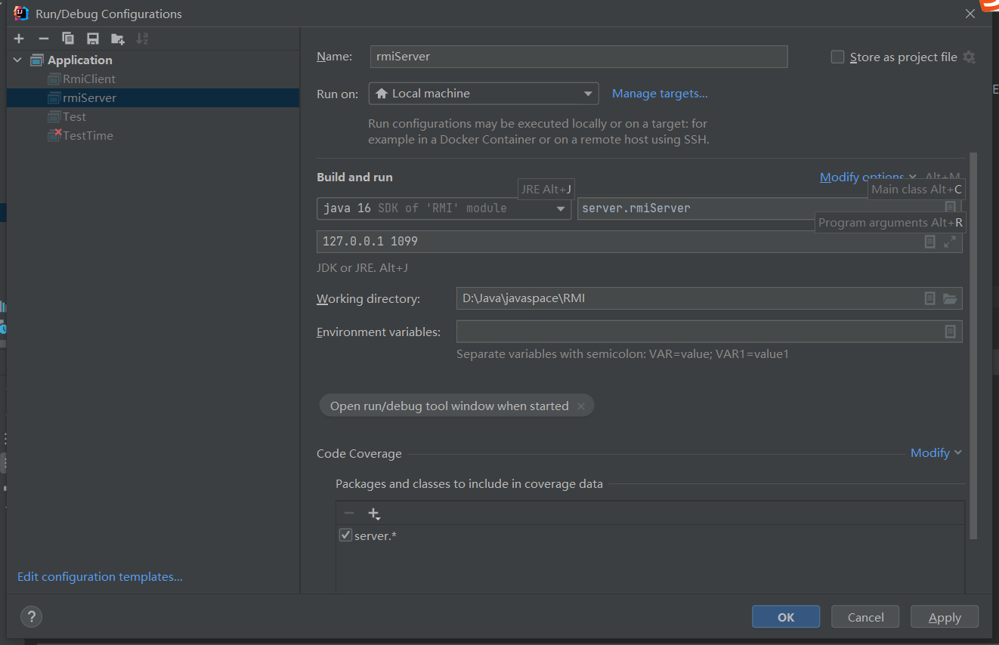

# 1、服务器

服务器启动接受两个参数，一个是服务器的地址，一个是服务器提供RMI服务的接口

# 2、客户端

客户端接受参数

`服务器地址 端口号 命令`

​																									**命令的格式**

## 2.1用户注册

因为我客户端输入参数就是创建一个lrq 则用户已存在，现在再创建则显示用户已存在

## 2.2增加会议

当会议增加的用户未注册时，会显示参加的哪个用户没有在系统

让我们加一个用户 

当会议创建人的密码错误或者不存在时显示:

输入正确密码：

创建会议如果有冲突时间重合时：

​	

创建的会议时间有问题

## 2.3查询会议

**参会人员的第一个是会议创建人**

（我的结果图都是从上面往下依次展示的，因此刚刚创建的会议现在能被查询到）

为了展示按时间顺序排序会议，再创建几个会议（会议没有做重名判断，因为我认为会议名是可以一样的，区分它们可以通过meetingId）

查询一下lrq参加的会议

可以看到是按时间顺序排序的

## 2.4删除会议

在查询一下	

我们会议id为 0 的 会议被删除了

因为lrq 是会议创建人，因此 该会议 也不存在于 lbw 和 lm 中了

我们把lbw 的mt2删除，因为lbw不是会议创建人，因此lrq 和 lm 还有mt2	

但是因为lbw不是会议创建人，没有权限删除这个会议。。。

## 2.5清除会议 

当有如下会议的时候，清除lrq创建的会议

一样的~

# 3、输一些奇怪的参数

`参数数量不足`

`不存在的命令`

`日期输入格式有问题`

# 4、退出

